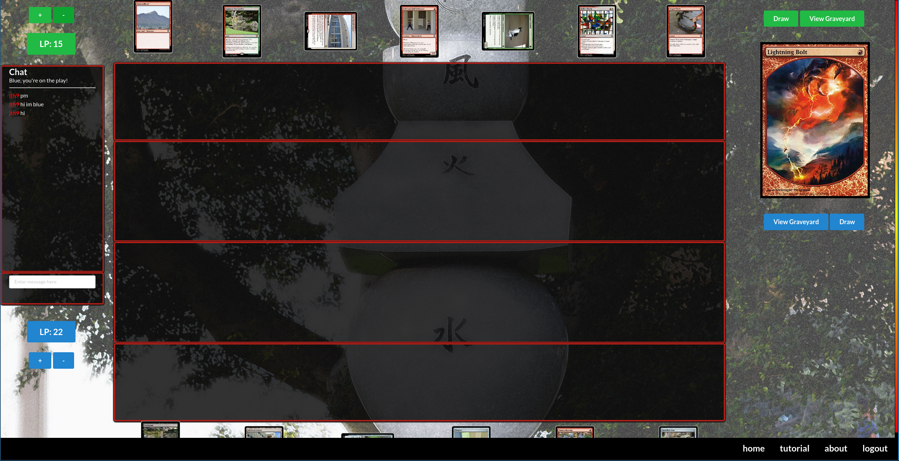

###Homepage:
https://manoa-the-gathering.github.io/

##Overview:
We have created the frontend for a full web-app over the course of October-December 2016.
Please note that our hosting on meteorapp.com will end at some point, and we will move hosting to a private server.

##My contributions:
I wrote, organized and published the tutorial for this app. I also created "new" cards based on existing
cards, to integrate the app with UH Manoa.

##Learning:
My takeaway from this project was a sense of how to work as a group and make sure that all members of a team
are on the same page.

